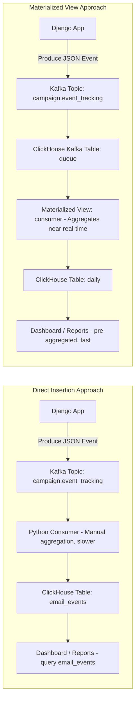

Perfect! Let’s explain the **full project end-to-end** using **Confluent Kafka + ClickHouse**, including **how data is produced, topics assigned, how it is consumed**, and **how to retrieve it**, with **settings.py configuration** for all Kafka and ClickHouse parameters. I’ll cover both **direct insertion** and **Materialized View** approaches.

---

# **PART 1: Direct ClickHouse Insertion**

## **1️⃣ Configuration in Django (`settings.py`)**

```python
# settings.py

KAFKA_SETTINGS = {
    "bootstrap_servers": "localhost:9092",
    "client_id": "django-campaign-producer",
    "group_id": "clickhouse-writer",
    "topics": {
        "event_tracking": "campaign.event_tracking",
        "audience_ready": "campaign.audience_ready",
        "template_ready": "campaign.template_ready"
    }
}

CLICKHOUSE_SETTINGS = {
    "host": "localhost",
    "username": "default",
    "password": "",
    "database": "campaigns"
}
```

* **Centralized configs** make producers/consumers reusable.

---

## **2️⃣ Step 1: Kafka Producer (Django)**

```python
# campaign/kafka_producer.py
import json
from confluent_kafka import Producer
from django.conf import settings

producer = Producer({
    'bootstrap.servers': settings.KAFKA_SETTINGS['bootstrap_servers'],
    'client.id': settings.KAFKA_SETTINGS['client_id']
})

def publish_event(topic_key: str, data: dict):
    topic = settings.KAFKA_SETTINGS['topics'][topic_key]
    producer.produce(topic=topic, value=json.dumps(data))
    producer.flush()
```

**Usage in Django campaign logic:**

```python
from campaign.kafka_producer import publish_event
from datetime import datetime

event = {
    "campaign_id": "123e4567-e89b-12d3-a456-426614174000",
    "workspace_id": "987e6543-e21b-32d1-a654-426614174999",
    "email": "user@example.com",
    "event_type": "delivered",
    "event_time": datetime.utcnow().isoformat(),
    "metadata": {"subject": "Welcome Email"}
}

publish_event("event_tracking", event)
```

* Each **type of event** (audience ready, template ready, email sent) is assigned a **dedicated topic**.
* Events are serialized as JSON.

---

## **3️⃣ Step 2: Kafka Topic Assignment**

| Event Type     | Kafka Topic               |
| -------------- | ------------------------- |
| Audience ready | `campaign.audience_ready` |
| Template ready | `campaign.template_ready` |
| Email sent     | `campaign.event_tracking` |

* Each topic allows **parallel consumers** and **replayable events**.

---

## **4️⃣ Step 3: ClickHouse Table (Direct Insertion)**

```sql
CREATE TABLE email_events
(
    campaign_id UUID,
    workspace_id UUID,
    email String,
    event_type Enum8('delivered'=1,'open'=2,'click'=3,'bounce'=4,'unsubscribe'=5),
    event_time DateTime,
    metadata String DEFAULT ''
)
ENGINE = MergeTree()
PARTITION BY toYYYYMMDD(event_time)
ORDER BY (campaign_id, event_time);
```

* Partitioned by day, ordered by campaign\_id + event\_time.
* Optimized for **high-volume inserts and queries**.

---

## **5️⃣ Step 4: Kafka Consumer → ClickHouse**

```python
# campaign/clickhouse_consumer.py
import json
from confluent_kafka import Consumer
from clickhouse_connect import Client
from django.conf import settings

ch = Client(
    host=settings.CLICKHOUSE_SETTINGS['host'],
    username=settings.CLICKHOUSE_SETTINGS['username'],
    password=settings.CLICKHOUSE_SETTINGS['password'],
    database=settings.CLICKHOUSE_SETTINGS['database']
)

consumer = Consumer({
    'bootstrap.servers': settings.KAFKA_SETTINGS['bootstrap_servers'],
    'group.id': settings.KAFKA_SETTINGS['group_id'],
    'auto.offset.reset': 'earliest'
})

consumer.subscribe([settings.KAFKA_SETTINGS['topics']['event_tracking']])

while True:
    msg = consumer.poll(1.0)
    if msg is None:
        continue
    if msg.error():
        print("Consumer error:", msg.error())
        continue

    event = json.loads(msg.value().decode('utf-8'))

    # Direct insertion into ClickHouse
    ch.insert('email_events', [{
        'campaign_id': event['campaign_id'],
        'workspace_id': event['workspace_id'],
        'email': event['email'],
        'event_type': event['event_type'],
        'event_time': event['event_time'],
        'metadata': json.dumps(event.get('metadata', {}))
    }])
```

---

## **6️⃣ Step 5: Data Retrieval**

```sql
-- Retrieve all opens for a campaign
SELECT email, event_time
FROM email_events
WHERE campaign_id = '123e4567-e89b-12d3-a456-426614174000'
  AND event_type = 'open'
ORDER BY event_time DESC;
```

* Flexible query on **raw events**.
* Good for **ad-hoc analytics** or detailed logs.

---

# **PART 2: Materialized View Using Kafka Table**

Now, the consumer is **ClickHouse itself**, no Python required for insertion.

---

## **1️⃣ Step 1: Kafka Table in ClickHouse**

```sql
CREATE TABLE queue
(
    timestamp UInt64,
    level String,
    message String
)
ENGINE = Kafka
SETTINGS
    kafka_broker_list = 'localhost:9092',
    kafka_topic_list = 'campaign.event_tracking',
    kafka_group_name = 'clickhouse-consumer',
    kafka_format = 'JSONEachRow';
```

* `queue` reads **events directly from Kafka**.
* ClickHouse automatically polls the topic.

---

## **2️⃣ Step 2: Aggregated Table**

```sql
CREATE TABLE daily
(
    day Date,
    level String,
    total UInt64
)
ENGINE = SummingMergeTree(day, (day, level), 8192);
```

* Stores **aggregated counts per day and event type**.

---

## **3️⃣ Step 3: Materialized View**

```sql
CREATE MATERIALIZED VIEW consumer
TO daily
AS
SELECT
    toDate(toDateTime(timestamp)) AS day,
    level,
    count() AS total
FROM queue
GROUP BY day, level;
```

* Automatically inserts aggregated counts into `daily` table.
* Near **real-time analytics**, no Python consumer needed.

---

## **4️⃣ Step 4: Data Retrieval**

```sql
-- Aggregated metrics per level (event type)
SELECT level, sum(total) AS total_count
FROM daily
GROUP BY level;
```

* Returns **fast, dashboard-ready aggregates**.
* For raw events, query `queue` table directly.

---

## **5️⃣ Step 5: How the Flow Works End-to-End**

1. **Django Producer** sends JSON events to `campaign.event_tracking`.
2. **Kafka Topic** persists events.
3. **ClickHouse Kafka Table (`queue`)** reads messages automatically.
4. **Materialized View (`consumer`) → `daily`** aggregates counts per day + event type.
5. **Retrieve aggregated metrics** with a simple query.

* No Python consumer is needed for insertion.
* Very **low-latency analytics**, perfect for dashboards.

---

# ✅ **Summary Table: Direct vs MV Approach**

| Feature           | Direct Insertion          | Kafka Table + Materialized View      |
| ----------------- | ------------------------- | ------------------------------------ |
| Consumer          | Python                    | Built-in ClickHouse                  |
| Aggregation       | Manual SQL queries        | Automatic via MV                     |
| Dashboard-ready   | Needs aggregation queries | Ready out-of-the-box                 |
| Raw events access | `email_events` table      | `queue` table                        |
| Complexity        | Moderate                  | Simple once Kafka + ClickHouse setup |

---

**draw a single end-to-end diagram** showing:

* **Django → Kafka → Consumer → ClickHouse (direct vs MV)**
* **Topics, tables, and retrieval paths**

                     ┌──────────────────┐
                     │   Django App     │
                     │ (Campaign Logic) │
                     └────────┬─────────┘
                              │
                       ┌──────▼─────────┐
                       │ Kafka Topic:   │
                       │ campaign.event │
                       │ _tracking      │
                       └──────┬─────────┘
                              │
                              ▼
                   ┌─────────────────────┐
                   │ ClickHouse Kafka    │
                   │ Table: queue        │
                   │ (reads Kafka topic) │
                   └─────────┬───────────┘
                             │
                             ▼
                   ┌─────────────────────┐
                   │ Materialized View   │
                   │ consumer → daily    │
                   │ (aggregated counts) │
                   └─────────┬───────────┘
                             │
                             ▼
                   ┌─────────────────────┐
                   │ Aggregated Data     │
                   │ Query: sum(total)   │
                   │ per event type      │
                   └─────────────────────┘


# More explaination regarding the sql queries
Absolutely! Let’s go **step by step**, explaining every line and concept clearly. I’ll assume **no prior SQL knowledge**.

---

# **Step 1: Kafka Source Table (`queue`)**

```sql
CREATE TABLE queue
(
    timestamp UInt64,
    level String,
    message String
)
ENGINE = Kafka
SETTINGS
    kafka_broker_list = 'localhost:9092',
    kafka_topic_list = 'campaign.event_tracking',
    kafka_group_name = 'clickhouse-consumer',
    kafka_format = 'JSONEachRow';
```

### **Line-by-line explanation**

1. `CREATE TABLE queue`

   * This tells ClickHouse: “I want a table named `queue`.”
   * A **table** is like a container for rows of data.

2. `(timestamp UInt64, level String, message String)`

   * These are the **columns** (fields) of the table:

     * `timestamp`: a number representing the time the event happened, stored as a 64-bit integer (`UInt64`).
     * `level`: a string indicating the type of event, e.g., `delivered`, `open`, `click`.
     * `message`: a string containing any extra info or description.

3. `ENGINE = Kafka`

   * Instead of storing data on disk like normal tables, this **table reads directly from Kafka topics**.
   * ClickHouse acts as a **consumer** here.

4. `SETTINGS`

   * These tell ClickHouse **how to connect to Kafka**:

     * `kafka_broker_list = 'localhost:9092'` → Kafka broker address.
     * `kafka_topic_list = 'campaign.event_tracking'` → the Kafka topic to read messages from.
     * `kafka_group_name = 'clickhouse-consumer'` → consumer group in Kafka (used to track offsets).
     * `kafka_format = 'JSONEachRow'` → tells ClickHouse how the messages are formatted (each row is a JSON object).

**✅ Purpose of this query:**

* This table **pulls events directly from Kafka**, without writing a Python consumer. Think of it as a “live stream” reader.

---

# **Step 2: Aggregated Table (`daily`)**

```sql
CREATE TABLE daily
(
    day Date,
    level String,
    total UInt64
)
ENGINE = SummingMergeTree(day, (day, level), 8192);
```

### **Line-by-line explanation**

1. `CREATE TABLE daily`

   * Creates a table called `daily`. This will **store aggregated results**, not raw Kafka messages.

2. `(day Date, level String, total UInt64)`

   * `day`: the date (without time), type `Date`.
   * `level`: type of event (same as before).
   * `total`: a number representing **how many events of that type happened on that day**.

3. `ENGINE = SummingMergeTree(day, (day, level), 8192)`

   * `MergeTree` family is ClickHouse’s engine for storing data efficiently.
   * `SummingMergeTree` automatically **adds values together** if rows have the same `(day, level)`.
   * `(day, level)` → the **key** that determines which rows are considered the same.
   * `8192` → size of data blocks ClickHouse uses internally (optimization, can mostly ignore at beginner level).

**✅ Purpose of this query:**

* This table will hold **aggregated counts** per day per event type, for fast queries and dashboards.

---

# **Step 3: Materialized View (`consumer`)**

```sql
CREATE MATERIALIZED VIEW consumer
TO daily
AS
SELECT
    toDate(toDateTime(timestamp)) AS day,
    level,
    count() AS total
FROM queue
GROUP BY day, level;
```

### **Line-by-line explanation**

1. `CREATE MATERIALIZED VIEW consumer`

   * A **Materialized View (MV)** is like a “smart table” that **automatically updates itself** whenever the source table changes.

2. `TO daily`

   * Tells ClickHouse: “Put the output of this MV into the `daily` table.”

3. `AS SELECT ... FROM queue`

   * Defines **what data the MV will calculate**:

     * `toDate(toDateTime(timestamp)) AS day` → converts the raw `timestamp` (integer) to a proper date.
     * `level` → the event type stays the same.
     * `count() AS total` → counts how many rows exist for each `(day, level)`.

4. `GROUP BY day, level`

   * Groups the raw events **by day and level** so that the count per group is calculated.
   * Without `GROUP BY`, you’d just get total counts over all rows, not per day/type.

**✅ Purpose of this query:**

* Automatically **aggregates Kafka events into daily counts** in `daily`.
* Whenever new events arrive in `queue`, `daily` updates itself automatically.

---

# **Workflow Summary**

1. **Django app produces events** → sends JSON messages to Kafka topic `campaign.event_tracking`.
2. **ClickHouse Kafka table `queue`** reads those events automatically.
3. **Materialized View `consumer`**:

   * Watches `queue`.
   * Groups events by date and level.
   * Inserts aggregated counts into `daily`.
4. **Query `daily`** to get metrics:

```sql
SELECT level, sum(total) AS total_count
FROM daily
GROUP BY level;
```

* This gives the **total number of delivered, opened, clicked, bounced events**, fast and ready for dashboards.

---

**In short:**

| Query      | Purpose                                                  |
| ---------- | -------------------------------------------------------- |
| `queue`    | Reads raw Kafka events directly.                         |
| `daily`    | Stores aggregated counts per day/event type.             |
| `consumer` | Automatically transforms raw events into `daily` counts. |

---

**draw a simple flow diagram** showing:

**Django → Kafka → queue → consumer → daily → query results**





Flow Explanation
Django produces events → JSON with timestamp, level, message.

Kafka topic stores events persistently.

ClickHouse Kafka table (queue) consumes events automatically.

Materialized View (consumer) aggregates events by day and level.

Aggregated counts inserted into daily table.

Dashboard/analytics queries daily → fast, ready-to-use metrics.

No Python consumer is needed for ClickHouse aggregation.

The process is near real-time.

Raw events are still accessible in the queue table for debugging or deeper analysis.


